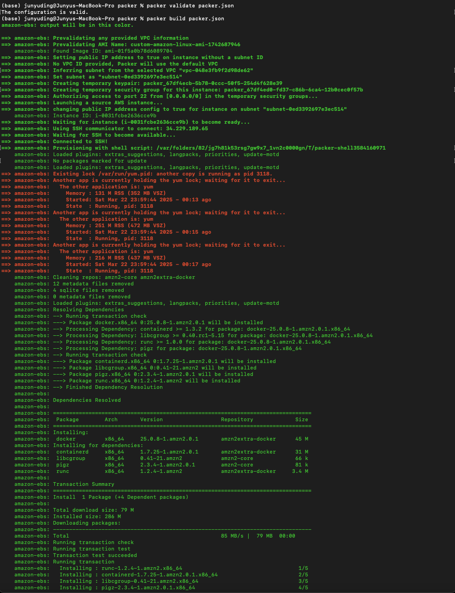
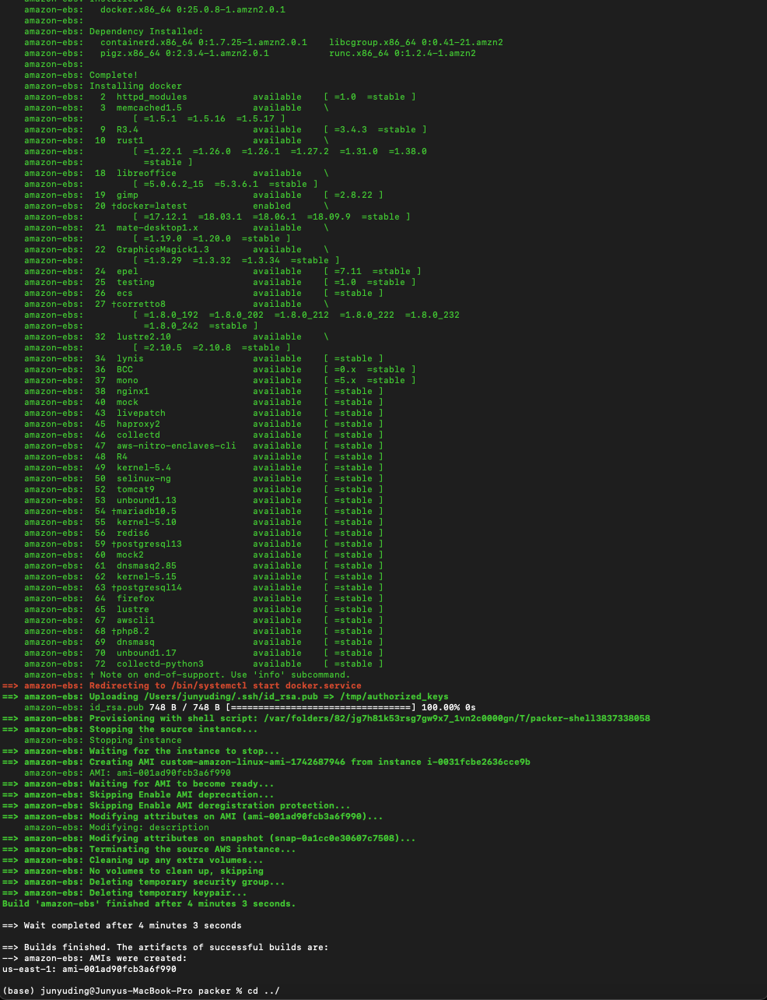
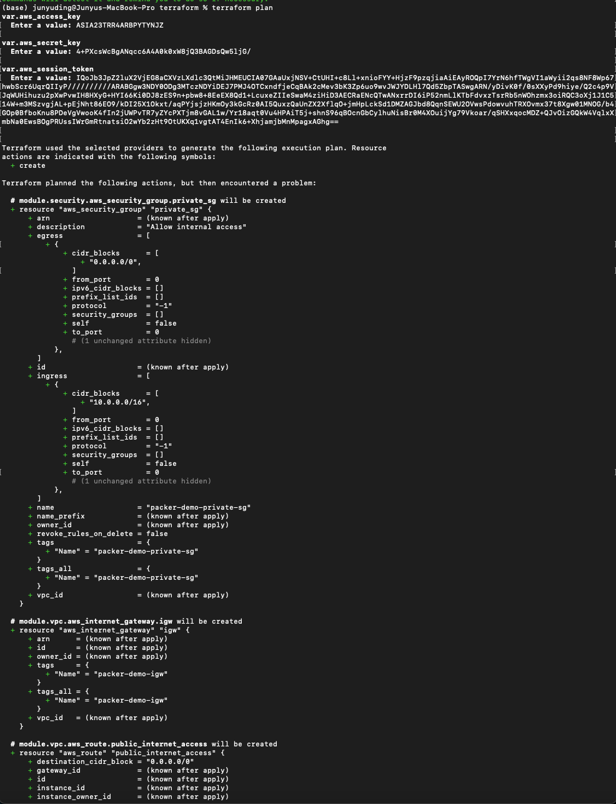
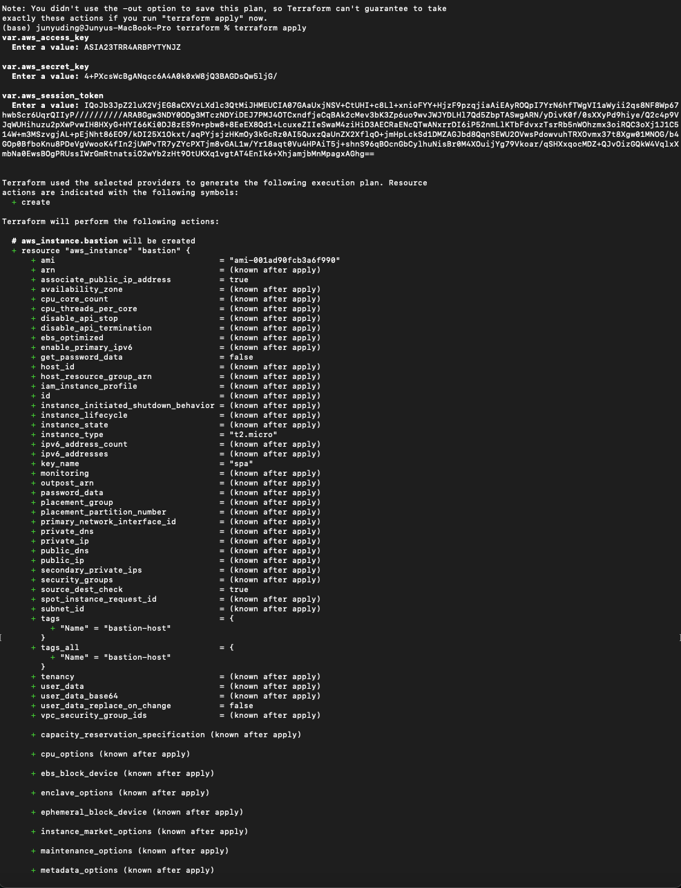
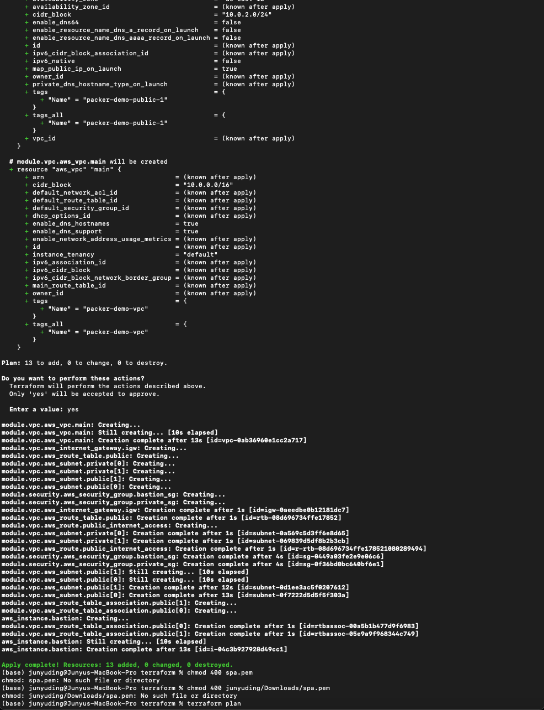
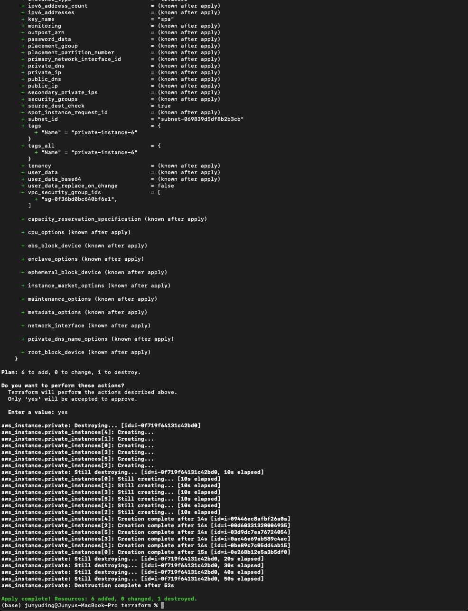
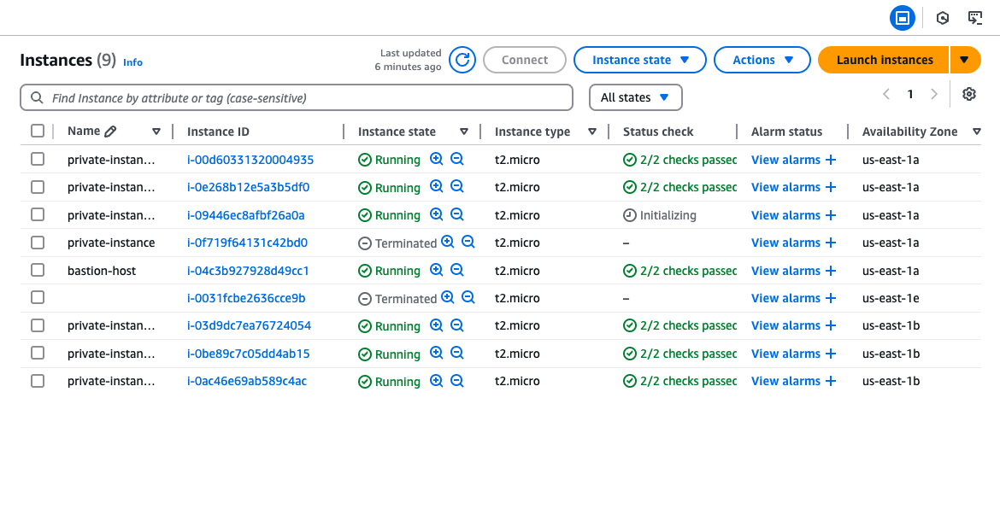

# AWS Infrastructure Provisioning with Packer and Terraform

This project demonstrates the provisioning of an AWS environment using **Packer** and **Terraform**. It includes the creation of a custom Amazon Machine Image (AMI) with Docker installed, and uses Terraform to deploy a secure VPC architecture with a bastion host and six private EC2 instances.

---

## ✅ Part A: Custom AMI with Packer

A custom AMI was created using [Packer](https://www.packer.io/) with the following specifications:

- **Base OS**: Amazon Linux 2
- **Software**: Docker installed and verified (`docker --version`)
- **SSH Access**: Configured with a public key to allow login using a private key

### 📁 Sample `packer.json` template:
```json
{
  "builders": [{
    "type": "amazon-ebs",
    "region": "us-east-1",
    "source_ami_filter": {
      "filters": {
        "virtualization-type": "hvm",
        "name": "amzn2-ami-hvm-*-x86_64-gp2",
        "root-device-type": "ebs"
      },
      "owners": ["amazon"],
      "most_recent": true
    },
    "instance_type": "t2.micro",
    "ssh_username": "ec2-user",
    "ami_name": "custom-amazon-linux-ami-{{timestamp}}"
  }],
  "provisioners": [{
    "type": "shell",
    "inline": [
      "sudo yum update -y",
      "sudo amazon-linux-extras install docker -y",
      "sudo service docker start",
      "sudo usermod -a -G docker ec2-user"
    ]
  }]
}
```

---

## ✅ Part B: AWS Infrastructure with Terraform

Terraform was used to deploy the following resources:

### 🔧 Modules Used:
- `vpc/`: Creates a VPC with public and private subnets, Internet Gateway, and route tables.
- `security/`: Creates security groups for the bastion host and private instances.

### 🌐 Networking:
- **VPC CIDR**: `10.0.0.0/16`
- **Public Subnets**: `10.0.1.0/24`, `10.0.2.0/24`
- **Private Subnets**: `10.0.101.0/24`, `10.0.102.0/24`

### 🛡️ Security:
- **Bastion Host SG**: Allows SSH (`port 22`) only from your IP.
- **Private SG**: Internal access only; no public IP assigned.

### 🚀 EC2 Instances:
- **Bastion Host**: Deployed in public subnet with SSH access.
- **6 Private Instances**: Deployed in private subnets using the custom AMI created via Packer.

---

## 📸 Screenshots
## VPC Setup Screenshot








## EC2 Instances List


---

# 🔧 Instructions to Run Project: Custom AMI with Packer + Terraform Infrastructure

This project creates a custom Amazon Linux AMI with Docker and provisions:
- A bastion host in a public subnet (SSH accessible only from your IP)
- 6 private EC2 instances (in two private subnets)

---

## ✅ Prerequisites
- AWS account (Academy credentials)
- [AWS CLI](https://docs.aws.amazon.com/cli/latest/userguide/install-cliv2.html)
- [Terraform](https://developer.hashicorp.com/terraform/downloads)
- [Packer](https://developer.hashicorp.com/packer/downloads)

---

## 1. ⚙️ Configure AWS CLI Credentials

```bash
aws configure
```

Or manually edit your credentials file:

**~/.aws/credentials**
```
[default]
aws_access_key_id     = <YOUR_AWS_ACCESS_KEY_ID>
aws_secret_access_key = <YOUR_AWS_SECRET_ACCESS_KEY>
aws_session_token     = <YOUR_AWS_SESSION_TOKEN>
```

Set your region:

**~/.aws/config**
```
[default]
region = us-east-1
```

✅ Verify credentials:

```bash
aws sts get-caller-identity
```

---

## 2. 🔑 Generate SSH Key and Import to AWS

This key allows Packer and Terraform to connect to EC2 instances.

a. Generate SSH Key (if not already created):

```bash
ssh-keygen -t rsa -b 2048 -f ~/.ssh/spa -N ""
```

b. Import Public Key to AWS:

```bash
aws ec2 import-key-pair \
  --key-name "spa" \
  --public-key-material fileb://~/.ssh/spa.pub
```

---

## 3. 📦 Build the AMI with Packer

⚠️ **Fix SSH Key Path First (Important!)**

Before running packer build, ensure the SSH key path in `packer.json` is valid.

If your `packer.json` contains:

```json
"source": "~/.ssh/id_rsa.pub",
```

Replace it with your full absolute path:

```json
"source": "/Users/junyuding/.ssh/id_rsa.pub",
```

Or run this one-liner:

```bash
sed -i '' 's|~/.ssh/id_rsa.pub|/Users/junyuding/.ssh/id_rsa.pub|' packer.json
```

Then run:

```bash
cd packer
packer validate packer.json
packer build packer.json
```

✅ After build, copy the generated AMI ID (e.g., `ami-0a443a001ef93bfa9`)

---

## 4. 📁 Update Terraform Variables

Edit `variables.tf` in terraform root folder:

```hcl
ami_id = "ami-0a443a001ef93bfa9"
my_ip  = "X.X.X.X/32"
```

✅ Find your IP:

```bash
curl ifconfig.me
```

---

## 5. 🚀 Deploy Infrastructure with Terraform

```bash
cd terraform
terraform init
terraform apply
```

Approve the plan with `yes`.

✅ Terraform will output:

```
bastion_public_ip = "54.xxx.xxx.xxx"
private_instance_ids = [
  "i-xxxxxxxxxxxxxxxxx",
  ...
]
```

---

## 6. 🔐 Connect to Bastion Host via SSH

```bash
ssh -i ~/.ssh/spa ec2-user@<bastion_public_ip>
```

✅ Once logged into the bastion:

```bash
chmod 400 spa.pem
```

(Optional) Transfer Key:

```bash
scp -i ~/.ssh/spa ~/.ssh/spa ec2-user@<bastion_public_ip>:~/spa.pem
```

---

## 7. 💻 Access Private EC2 Instances

From the Bastion:

```bash
ssh -i spa.pem ec2-user@10.0.x.x
```

✅ Once inside:

```bash
cat /etc/os-release
sudo service docker start
docker --version
ping 10.0.x.x
```

---

## 📂 Project Structure

```
project-root/
├── packer-ami/
│   └── ami.pkr.hcl
├── terraform/
│   ├── main.tf
│   ├── terraform.tfvars
│   └── modules/
│       ├── vpc/
│       └── security/
├── screenshots/
├── README.md
```

---

## ✅ Final Checklist
- [x] Custom AMI contains Docker + SSH
- [x] Bastion Host in Public Subnet
- [x] 6 Private EC2 Instances deployed using AMI
- [x] SSH access configured and validated
